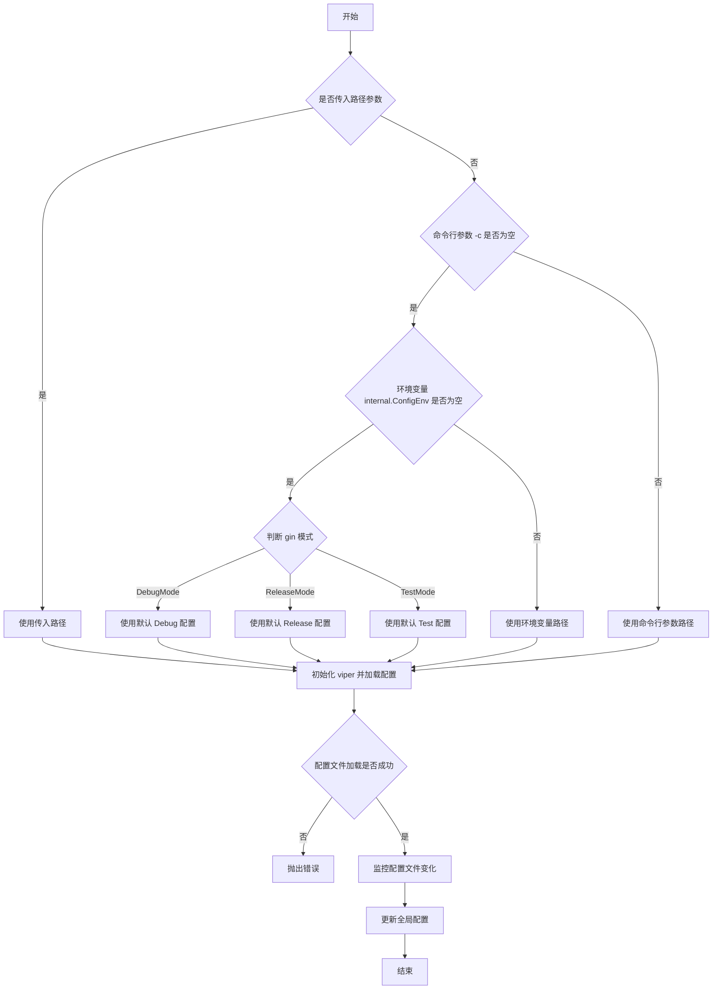

```mermaid
flowchart TD
    A[开始] --> B{是否传入路径参数}
    B -->|是| C[使用传入路径]
    B -->|否| D{命令行参数 -c 是否为空}
    D -->|是| E{环境变量 internal.ConfigEnv 是否为空}
    E -->|是| F{判断 gin 模式}
    F -->|DebugMode| G[使用默认 Debug 配置]
    F -->|ReleaseMode| H[使用默认 Release 配置]
    F -->|TestMode| I[使用默认 Test 配置]
    E -->|否| J[使用环境变量路径]
    D -->|否| K[使用命令行参数路径]
    C --> L[初始化 viper 并加载配置]
    G --> L
    H --> L
    I --> L
    J --> L
    K --> L
    L --> M{配置文件加载是否成功}
    M -->|否| N[抛出错误]
    M -->|是| O[监控配置文件变化]
    O --> P[更新全局配置]
    P --> Q[结束]
```